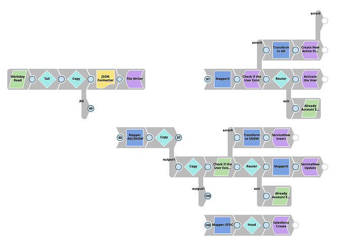

# Overview

Use this Pipeline pattern to fully automate account and file management for a new hire and deprovision system access when an employee leaves a company.

**Pipeline #1 Workday Event Based Integration**

****.png>)****

This Pipeline is triggered by employee hire/termination events in Workday, in turn triggering one of the next two child Pipelines.

**Pipeline #2 Employee Onboarding**

********

This child Pipeline is called by Pipeline #1 when an employee is added.

**Pipeline #3 Employee Off-boarding**

****.png>)****

This child Pipeline is called by Pipeline #1 when an employee is off-boarded.
